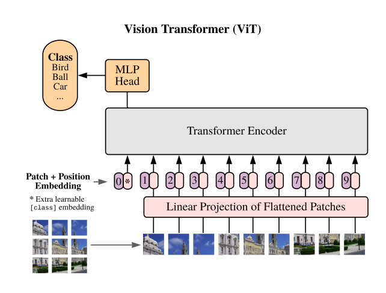

# CATS vs DOGS training using VIT

Here the training uses linformer which is a linear transformer used to speed up the training and inference. This is used as a replacement for the basic transformer block.

#### Inputs
The data is taken from the kaggle dataset dogs-vs-cats. Which can be downloaded using
```
kaggle competitions download -c dogs-vs-cats
```
#### Model Used
Please check the Classes section below

#### Training logs

```
100%|██████████| 313/313 [03:20<00:00,  1.56it/s]
Epoch : 1 - loss : 0.6965 - acc: 0.5084 - val_loss : 0.6918 - val_acc: 0.5198

100%|██████████| 313/313 [03:19<00:00,  1.57it/s]
Epoch : 2 - loss : 0.6926 - acc: 0.5166 - val_loss : 0.6885 - val_acc: 0.5259

100%|██████████| 313/313 [03:20<00:00,  1.56it/s]
Epoch : 3 - loss : 0.6871 - acc: 0.5401 - val_loss : 0.6783 - val_acc: 0.5767

100%|██████████| 313/313 [03:22<00:00,  1.55it/s]
Epoch : 4 - loss : 0.6761 - acc: 0.5775 - val_loss : 0.6659 - val_acc: 0.5963

100%|██████████| 313/313 [03:22<00:00,  1.55it/s]
Epoch : 5 - loss : 0.6726 - acc: 0.5774 - val_loss : 0.6677 - val_acc: 0.5837

100%|██████████| 313/313 [03:22<00:00,  1.54it/s]
Epoch : 6 - loss : 0.6626 - acc: 0.5945 - val_loss : 0.6578 - val_acc: 0.6084

100%|██████████| 313/313 [03:25<00:00,  1.53it/s]
Epoch : 7 - loss : 0.6576 - acc: 0.6024 - val_loss : 0.6461 - val_acc: 0.6100

100%|██████████| 313/313 [03:21<00:00,  1.55it/s]
Epoch : 8 - loss : 0.6512 - acc: 0.6071 - val_loss : 0.6462 - val_acc: 0.6187

100%|██████████| 313/313 [03:21<00:00,  1.55it/s]
Epoch : 9 - loss : 0.6436 - acc: 0.6190 - val_loss : 0.6393 - val_acc: 0.6240

100%|██████████| 313/313 [03:23<00:00,  1.54it/s]
Epoch : 10 - loss : 0.6403 - acc: 0.6244 - val_loss : 0.6325 - val_acc: 0.6329

100%|██████████| 313/313 [03:21<00:00,  1.55it/s]
Epoch : 11 - loss : 0.6319 - acc: 0.6346 - val_loss : 0.6203 - val_acc: 0.6501

100%|██████████| 313/313 [03:26<00:00,  1.51it/s]
Epoch : 12 - loss : 0.6277 - acc: 0.6387 - val_loss : 0.6243 - val_acc: 0.6470

100%|██████████| 313/313 [03:19<00:00,  1.57it/s]
Epoch : 13 - loss : 0.6185 - acc: 0.6491 - val_loss : 0.6263 - val_acc: 0.6475

100%|██████████| 313/313 [03:18<00:00,  1.58it/s]
Epoch : 14 - loss : 0.6096 - acc: 0.6566 - val_loss : 0.6085 - val_acc: 0.6626

100%|██████████| 313/313 [03:22<00:00,  1.54it/s]
Epoch : 15 - loss : 0.6067 - acc: 0.6629 - val_loss : 0.6057 - val_acc: 0.6650

100%|██████████| 313/313 [03:25<00:00,  1.52it/s]
Epoch : 16 - loss : 0.6016 - acc: 0.6685 - val_loss : 0.6026 - val_acc: 0.6667

100%|██████████| 313/313 [03:20<00:00,  1.56it/s]
Epoch : 17 - loss : 0.5978 - acc: 0.6734 - val_loss : 0.6002 - val_acc: 0.6620

100%|██████████| 313/313 [03:25<00:00,  1.52it/s]
Epoch : 18 - loss : 0.5957 - acc: 0.6688 - val_loss : 0.5969 - val_acc: 0.6721

100%|██████████| 313/313 [03:26<00:00,  1.52it/s]
Epoch : 19 - loss : 0.5919 - acc: 0.6789 - val_loss : 0.5914 - val_acc: 0.6786

100%|██████████| 313/313 [03:16<00:00,  1.60it/s]
Epoch : 20 - loss : 0.5918 - acc: 0.6781 - val_loss : 0.5851 - val_acc: 0.6830

Training Complete
```

# Classes


#### Patch embedding:
The images are split into patches. The patches can be let's say 16x16 or 32x32 size then the image size needs to be divisible by this number. This can be done using convolution layer of kernel size 16 and stride 16. The patches are then flattened using a linear layer and embedded with the position information. Patch embedding is a bit vector that contains semantic information about the patch along with the position information. Say this is 128 bits. Then the idea is that the patch around a dog's ear and a patch around the dog's tail will have closer similarity than with patch of the background sky. Patch embeddings are updated in each transformer layer using the QKV mechanism (below). The classification token is added to this patch embedding and this is called combined embedding.


#### Attention Mechanism
Number of attention heads. The embedding has a depth paramter to it as well. The main goal is to find which patch is similiar to other patches. In other words context i.e dog ear patch correlate with other parts of the dog. This idea is done using Query, Key, Value mechanism. The cross product of the query and key gives a number will tells how relevant the current patch is with the other patches. This number is then multiplied with the value to create more focus or attention to the parts that matter. By this method we store all relevant context of the dog ear with respect to the dog in each embedding.

#### MLP:
The MLP block consists of two linear layers and GELU non linearity. Unlike the 12 tranformer layers that take all the N^2+1 embeddings as inputs, the MLP only takes the classification token as input and converts it to one of the output classes via linear layer.
